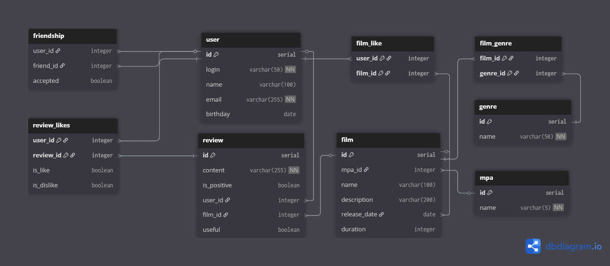

# Filmorate
Simple service with REST API, works with films and user ratings, likes and recommendations, and event log.

## Group project team at Sprint 13
- @kl-vl
- @ArtemixSled
- @avv37
- @IRognarI

## Project kanban
https://github.com/users/kl-vl/projects/3/views/1

### Entities 
1. User
- ID - User identifier;
- NAME - User name;
- LOGIN - User login;
- EMAIL - Email address;
- BIRTHDAY - Date of birth;
- 
2. Film
- ID - Film identifier;
- NAME - Film title;
- DESCRIPTION - Film description;
- RELEASE_DATE - Release date of the film;
- DURATION - Film duration;
- MPA_ID - Film rating;

3. Genre
- ID - Film identifier;
- NAME - Genre name;

4. MPA_RATING
- ID - Rating identifier;
- NAME - Rating name;

5. FRIENDSHIP
- USER_ID - User identifier;
- FRIEND_ID - Friend identifier;
- ACCEPTED - Friendship status;

6. FILM_LIKE
- FILM_ID - User identifier;
- USER_ID - Film identifier; 

7. DIRECTOR
- ID - Director identifier;
- NAME - Director name;
 
8. FILM_DIRECTOR
- FILM_ID - Film identifier;
- DIRECTOR_ID - Director identifier;

9. REVIEW
- ID - Review identifier;
- FILM_ID - Film identifier;
- USER_ID - User identifier;
- CONTENT - Review content;
- IS_POSITIVE - Positive/negative review;
- USEFUL - Rating of review;

10. 0REVIEW_LIKE
- REVIEW_ID - Rating identifier;
- USER_ID - User identifier;
- IS_DISLIKE - Dislike flag;

## Application functions:
## Film
- Adding a film
- Updating a film
- Retrieving all films
- Like films
- Popular films list

## User
- Creating a user
- Updating a user
- Retrieving a list of all users
- Add friends
- Get common friends


## ER diagram



## REST endpoints
1. GET /users - list of users
2. POST /users - user create
3. PUT /users - user update
4. GET /users/{id} - get user by id
5. PUT /users/{id}/friends/{friendId} — add friend
6. DELETE /users/{id}/friends/{friendId} — delete friend
7. GET /users/{id}/friends — friends list
8. GET /users/{id}/friends/common/{otherId} — список друзей, общих с другим пользователем.

9. GET /films - list of films
10. POST /films - create film
11. PUT /users - update film
12. GET /films/{id} - get film by id
13. PUT /films/{id}/like/{userId} — add film like
14. DELETE /films/{id}/like/{userId} — delete film like
15. GET /films/popular?count={count} — get N popular films by likes


## SQL queries examples

1. List of first 100 users
```
SELECT id, login, name, email, birthday
FROM "user"
ORDER BY id
LIMIT 100;
```
2. User create
```aiignore
INSERT INTO "user" (login, name, email, birthday)
VALUES ('john_doe', 'John Doe', 'john@example.com', '1990-05-15')
RETURNING id, login, name, email, birthday;
```
3. User update
```aiignore
UPDATE "user"
SET 
    login = 'new_login',
    name = 'New Name',
    email = 'new@email.com',
    birthday = '1991-06-20',
    updated_at = NOW()
WHERE id = 123
RETURNING id, login, name, email, birthday;
```
4. Get user by id
```
SELECT id, login, name, email, birthday
FROM "user"
WHERE id = 123
LIMIT 1;
```
5. Add friend
```aiignore
INSERT INTO friendship (user_id, friend_id)
VALUES (123, 456)
ON CONFLICT (user_id, friend_id) DO NOTHING;
```

6. Delete friend
```aiignore
DELETE FROM friendship 
WHERE user_id = 123 AND friend_id = 456;
```
7. Friends list
```aiignore
SELECT u.id, u.name
FROM friendship f
JOIN "user" u ON f.friend_id = u.id
WHERE f.user_id = 123 AND f.accepted = true;
```

8. Common friends list
```aiignore
SELECT 
    u.id,
    u.name,
    u.email
FROM "user" u
WHERE EXISTS (
    SELECT 1 FROM friendship
    WHERE ((user_id = 123 AND friend_id = u.id) OR (friend_id = 123 AND user_id = u.id))
    AND accepted = true
)
AND EXISTS (
    SELECT 1 FROM friendship
    WHERE ((user_id = 456 AND friend_id = u.id) OR (friend_id = 456 AND user_id = u.id))
    AND accepted = true
)
ORDER BY u.name;
```

9. List of films
```aiignore
SELECT id, name, description, release_date, duration, likes_count 
FROM film
ORDER BY name;
```

10. Create film
```aiignore
INSERT INTO film (name, description, release_date, duration, rate_id)
VALUES (
    'Крепкий орешек', 
    'Полицейский пытается спасти небоскреб от террористов',
    '1988-07-15',
    132,
    4  -- ID рейтинга (например, R)
)
RETURNING id;
```
11. Update film
```aiignore
UPDATE film
SET 
    name = 'Крепкий орешек 2',
    description = 'Продолжение приключений Джона Макклейна',
    release_date = '1990-07-04',
    duration = 124,
    rate_id = 4
WHERE id = 123
RETURNING *;
```

12. Get film by id
```aiignore
SELECT 
    f.id,
    f.name,
    f.description,
    f.release_date,
    f.duration,
    f.likes_count,
    r.name AS rating_name
FROM film f
LEFT JOIN rate r ON f.rate_id = r.id
WHERE f.id = 123;
```
13. Add film like
```aiignore
INSERT INTO film_likes (user_id, film_id)
VALUES (123, 456)  -- user_id = 123, film_id = 456
ON CONFLICT (user_id, film_id) DO NOTHING;
```
14. Delete film like
```aiignore
DELETE FROM film_likes
WHERE user_id = 123 AND film_id = 456;
```
15. Get top 10 films by likes
```aiignore
SELECT 
    f.id,
    f.name,
    f.release_date,
    f.duration,
    f.likes_count,
    r.name AS rating_name
FROM film f
LEFT JOIN rate r ON f.rate_id = r.id
ORDER BY f.likes_count DESC
LIMIT 10;
```


## Group project team
- @kl-vl
- @ArtemixSled
- @avv37
- @IRognarI
- 

## Project kanban
https://github.com/users/kl-vl/projects/3/views/1
